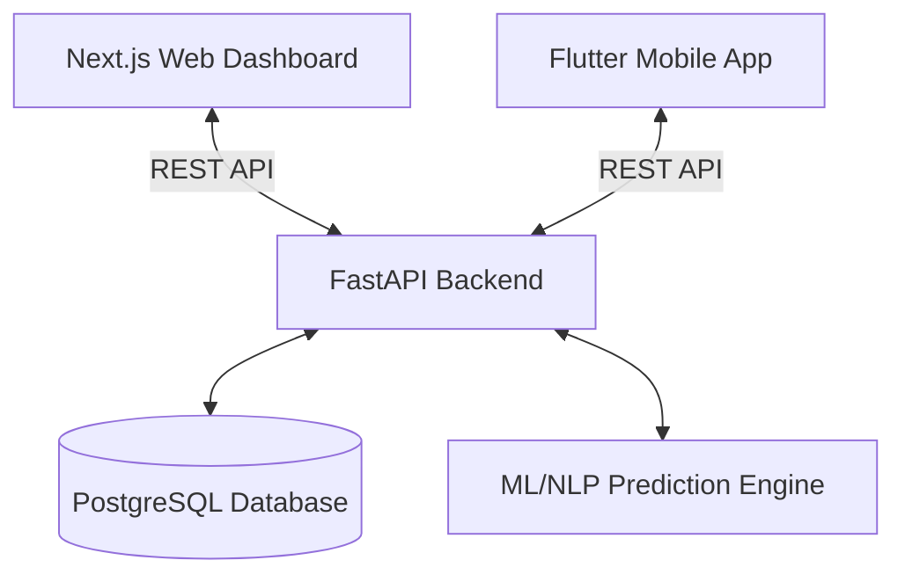

<!-- TOPLINE -->

# AI-Powered DPR Analysis System

The **DPR (Detailed Project Report) Analysis System** is an advanced, full-stack software suite designed to automate and standardize the evaluation of infrastructure and development projects for the **Ministry of Development of North Eastern Region (MDoNER)**. 

By leveraging cutting-edge Natural Language Processing (NLP) and Machine Learning (ML), the system analyzes lengthy DPR documents, predicts risks, and provides actionable insights across eight critical dimensions, thereby streamlining the approval process and reducing financial risks.

---

## 🏗️ System Architecture

This monorepo uses a microservices-inspired architecture separated into three core domains:

1. **`dpr-web`**: Next.js Admin Dashboard
2. **`dpr-mobile`**: Flutter Mobile App for Field Officers
3. **`dpr-backend`**: FastAPI Backend & Machine Learning Engine



---

## 1. Web Dashboard (`dpr-web`)

The Web Dashboard serves as the primary interface for MDoNER officials, reviewers, and administrative staff. It is built for speed, SEO (where necessary), and rich interactivity.

### Core Features:
- **DPR Upload & Parsing:** Interface to upload PDF/Word versions of DPRs for processing.
- **Risk Assessment Dashboard:** Visual graphs and metrics detailing the AI's risk predictions across the 8 dimensions.
- **Approval Workflow:** Tools to approve, reject, or request modifications for projects.
- **Role-Based Access Control (RBAC):** Distinct views for admins, reviewers, and external stakeholders.

### Tech Stack:
- **Framework:** Next.js (App Router)
- **Language:** TypeScript
- **Styling:** Tailwind CSS (for rapid, responsive design)
- **State Management:** React Context / Zustand (planned)

---

## 2. Mobile Application (`dpr-mobile`)

The Mobile Application is a tool for on-ground field officers and site inspectors to verify that the claims made in a DPR match reality.

### Core Features:
- **Offline Mode:** Capability to enter field data in areas with low connectivity, syncing later.
- **Site Verification:** Tools to upload geo-tagged images, notes, and checklist evaluations.
- **Push Notifications:** Alerts for newly assigned projects or urgent data requests from reviewers.
- **Cross-Platform:** Runs natively on both Android and iOS devices.

### Tech Stack:
- **Framework:** Flutter
- **Language:** Dart
- **State Management:** Provider / Riverpod (planned)
- **Network Client:** Dio / HTTP

---

## 3. Backend API & AI Engine (`dpr-backend`)

The backend is the brains of the operation. It handles data persistence, user authentication, and interfaces with the Machine Learning models.

### Core Features:
- **RESTful Endpoints:** Serves data to both the Web Dashboard and the Mobile App.
- **Document Processing Pipeline:** Extracts text from PDFs and structures it for AI inference.
- **Risk Prediction:** Runs the extracted text against trained models to generate a risk score from 0-100.
- **Secure Authentication:** JWT-based authentication for securing endpoints.

### Tech Stack:
- **Framework:** FastAPI (Python 3.11+)
- **Database ORM:** SQLAlchemy
- **Data Validation:** Pydantic
- **AI Libraries:** Scikit-Learn, PyTorch, HuggingFace Transformers

---

## 🧠 The 8 Evaluation Dimensions

The core logic of the AI prediction engine evaluates every project against the following standard dimensions to ensure holistic evaluation:

| Dimension | Description | ML Focus Area |
| :--- | :--- | :--- |
| **1. Financial Feasibility** | Assessment of budgets, ROI, and cost-benefit ratios. | Numerical anomaly detection, regression. |
| **2. Technical Viability** | Evaluation of the proposed technology, engineering methods, and materials. | Entity extraction (materials, methods). |
| **3. Environmental Impact** | Checking for compliance with ecological standards and potential harm. | Sentiment analysis, compliance mapping. |
| **4. Social Benefit** | Projecting the positive impact on the local population and economy. | NLP classification of social outcomes. |
| **5. Regulatory Compliance** | Verification against state and federal laws and MDoNER guidelines. | Rule-based NLP text matching. |
| **6. Execution Timeline** | Analysis of the proposed schedule for realistic completion. | Sequence modeling, historical timeline comparison. |
| **7. Resource Allocation** | Checking if labor, machinery, and capital are adequately distributed. | Optimization algorithms. |
| **8. Risk Assessment** | A holistic overview identifying potential bottlenecks or failure points. | Ensemble learning combining all factors. |

---

## 🚀 Setup & Installation

### Prerequisites
- Node.js (v18+)
- Python (v3.10+)
- Flutter SDK (v3.19+)
- PostgreSQL (Local or Cloud)

### Running the Web Dashboard
```bash
cd dpr-web
npm install
npm run dev
```
*The web dashboard will be available at `http://localhost:3000`.*

### Running the Backend API
```bash
cd dpr-backend
python -m venv venv
# On Windows: .\venv\Scripts\activate
# On Mac/Linux: source venv/bin/activate
pip install -r requirements.txt
uvicorn main:app --reload
```
*The Swagger API documentation will be available at `http://localhost:8000/docs`.*

### Running the Mobile App
```bash
cd dpr-mobile
flutter pub get
flutter run
```
*Ensure you have an emulator running or a physical device connected.*
